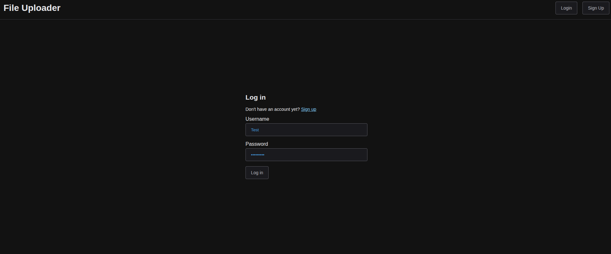
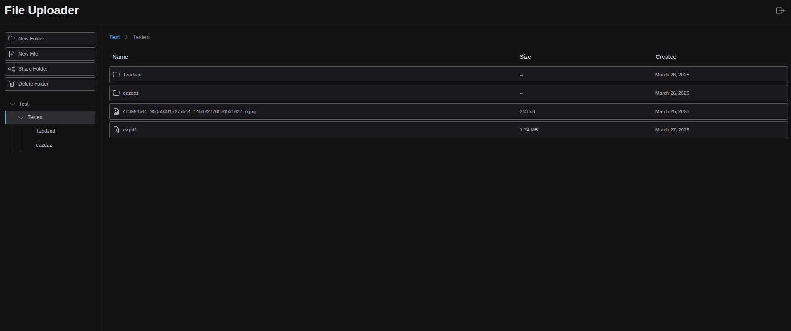
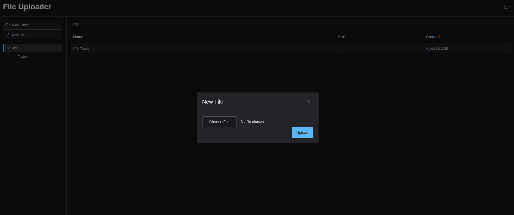
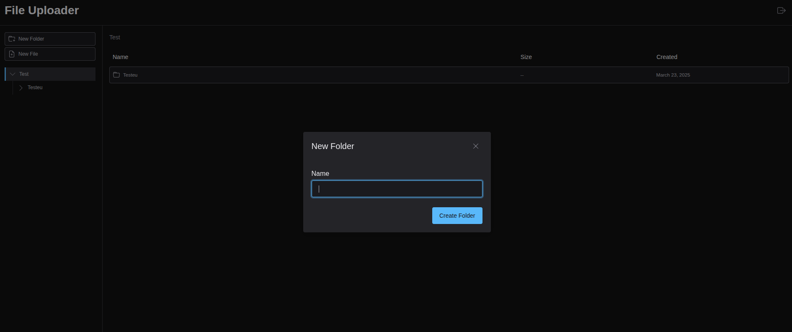

# FileUploader: A Minimal Google Drive Clone 📁☁️

**FileUploader** is a fullstack file management web app inspired by Google Drive. It allows users to upload, manage, and download files with a clean interface, secure authentication, and RESTful backend.

---

## 📁 Project Repositories

| Layer      | Repository                                                                 |
|------------|----------------------------------------------------------------------------|
| 🌐 Frontend | [FileUploaderFront](https://github.com/TahaLoghmari/FileUploaderFront)    |
| ⚙️ Backend  | [FileUploaderBack](https://github.com/TahaLoghmari/FileUploaderBack)      |

---

## 🧠 Tech Stack

### 🔹 Frontend
- React + Vite
- Tailwind CSS
- ShadCN UI
- JavaScript

### 🔹 Backend
- ASP.NET Core Web API
- Entity Framework Core
- PostgreSQL
- JWT Authentication

---

## ✨ Features

- 🔐 Secure login and registration
- 📤 File upload with Cloudinary
- 📁 File listing with metadata
- 📥 Download files
- 🗑️ Delete file functionality
- 🎨 Responsive UI with modern components (ShadCN + Tailwind)

---

## 🖼️ Screenshots

---
